# SkillGuard Architecture

This document explains how SkillGuard turns a directory of Markdown skill files into a pass/fail verdict, and the
principles behind the design. For install and usage instructions see the [README](README.md). For contributing
see [DEVELOPMENT.md](DEVELOPMENT.md).

## Architecture Diagram

Click a component to open its source on GitHub.

```mermaid
flowchart TD

subgraph group_cli["CLI orchestration"]
  node_cli_entry["CLI entry<br/>[main.go]"]
  node_command_dispatcher["Command dispatcher<br/>[root.go]"]
  node_scan_command["Scan command<br/>[scan.go]"]
  node_path_resolver["Path resolver<br/>[scan.go]"]
  node_analysis_orchestrator["File analyzer<br/>[scan.go]"]
end

subgraph group_input["Input processing"]
  node_file_discovery["File discovery<br/>[markdown.go]"]
  node_markdown_parser["Markdown parser<br/>[markdown.go]"]
  node_reference_extractor["Reference extractor<br/>[scorer.go]"]
end

subgraph group_analysis["Security analysis"]
  node_security_scorer["Security scorer<br/>[scorer.go]"]
  node_risk_detectors["Risk detectors<br/>[scorer.go]"]
  node_score_calculator["Score calculator<br/>[scorer.go]"]
  node_result_model["Analysis results<br/>[types.go]"]
end

subgraph group_output["Results and config"]
  node_config_manager["Config manager<br/>[config.go]"]
  node_report_renderer["Report renderer<br/>[scan.go]"]
  node_json_writer["JSON writer<br/>[scan.go]"]
  node_exit_status["Exit status<br/>[root.go]"]
end

node_developer(("Developer"))
node_ci(("CI pipeline"))
node_skill_files["Skill files"]
node_config_file[("Config file")]

node_developer -->|"invokes"| node_cli_entry
node_ci -.->|"invokes"| node_cli_entry
node_cli_entry -->|"starts"| node_command_dispatcher
node_command_dispatcher -->|"dispatches scan"| node_scan_command
node_command_dispatcher -->|"dispatches config"| node_config_manager
node_scan_command -->|"loads config"| node_config_manager
node_config_manager -->|"reads or writes"| node_config_file
node_scan_command -->|"resolves paths"| node_path_resolver
node_path_resolver -->|"selects inputs"| node_file_discovery
node_file_discovery -->|"scans files"| node_skill_files
node_scan_command -->|"analyzes files"| node_analysis_orchestrator
node_analysis_orchestrator -->|"parses skills"| node_markdown_parser
node_analysis_orchestrator -.->|"extracts references"| node_reference_extractor
node_analysis_orchestrator -->|"analyzes content"| node_security_scorer
node_reference_extractor -.->|"analyzes references"| node_security_scorer
node_security_scorer -->|"runs checks"| node_risk_detectors
node_security_scorer -->|"calculates scores"| node_score_calculator
node_security_scorer -->|"builds findings"| node_result_model
node_scan_command -->|"prints report"| node_report_renderer
node_scan_command -.->|"writes JSON"| node_json_writer
node_scan_command -->|"checks outcome"| node_exit_status
node_command_dispatcher -->|"maps result"| node_exit_status
node_report_renderer -->|"shows results"| node_developer
node_json_writer -.->|"exports report"| node_developer
node_exit_status -.->|"returns status"| node_ci

click node_cli_entry "https://github.com/ossafrica/skillguard/blob/main/main.go"
click node_command_dispatcher "https://github.com/ossafrica/skillguard/blob/main/cmd/root.go"
click node_scan_command "https://github.com/ossafrica/skillguard/blob/main/cmd/scan.go"
click node_path_resolver "https://github.com/ossafrica/skillguard/blob/main/cmd/scan.go"
click node_config_manager "https://github.com/ossafrica/skillguard/blob/main/cmd/config.go"
click node_file_discovery "https://github.com/ossafrica/skillguard/blob/main/internal/parser/markdown.go"
click node_markdown_parser "https://github.com/ossafrica/skillguard/blob/main/internal/parser/markdown.go"
click node_reference_extractor "https://github.com/ossafrica/skillguard/blob/main/internal/analyzer/scorer.go"
click node_analysis_orchestrator "https://github.com/ossafrica/skillguard/blob/main/cmd/scan.go"
click node_security_scorer "https://github.com/ossafrica/skillguard/blob/main/internal/analyzer/scorer.go"
click node_risk_detectors "https://github.com/ossafrica/skillguard/blob/main/internal/analyzer/scorer.go"
click node_score_calculator "https://github.com/ossafrica/skillguard/blob/main/internal/analyzer/scorer.go"
click node_result_model "https://github.com/ossafrica/skillguard/blob/main/internal/model/types.go"
click node_report_renderer "https://github.com/ossafrica/skillguard/blob/main/cmd/scan.go"
click node_json_writer "https://github.com/ossafrica/skillguard/blob/main/cmd/scan.go"
click node_exit_status "https://github.com/ossafrica/skillguard/blob/main/cmd/root.go"

classDef toneNeutral fill:#f8fafc,stroke:#334155,stroke-width:1.5px,color:#0f172a
classDef toneBlue fill:#dbeafe,stroke:#2563eb,stroke-width:1.5px,color:#172554
classDef toneAmber fill:#fef3c7,stroke:#d97706,stroke-width:1.5px,color:#78350f
classDef toneMint fill:#dcfce7,stroke:#16a34a,stroke-width:1.5px,color:#14532d
classDef toneRose fill:#ffe4e6,stroke:#e11d48,stroke-width:1.5px,color:#881337
classDef toneIndigo fill:#e0e7ff,stroke:#4f46e5,stroke-width:1.5px,color:#312e81
classDef toneTeal fill:#ccfbf1,stroke:#0f766e,stroke-width:1.5px,color:#134e4a
class node_cli_entry,node_command_dispatcher,node_scan_command,node_path_resolver,node_analysis_orchestrator toneBlue
class node_file_discovery,node_markdown_parser,node_reference_extractor,node_config_file toneAmber
class node_security_scorer,node_risk_detectors,node_score_calculator,node_result_model toneMint
class node_config_manager,node_report_renderer,node_json_writer,node_exit_status toneRose
class node_developer,node_ci,node_skill_files toneIndigo
```



## Design Principles

These principles are not written down anywhere else. They come from how the code behaves and from the comments that
explain its decisions. New detectors and features should follow them.

1. **Static analysis only.** SkillGuard reads skills and never runs them. Nothing in a skill, and nothing it references,
   is executed, loaded, or fetched over the network. A scan is safe to run on a skill you do not trust, which is the
   whole point of scanning it.

2. **The skill is hostile input.** The skill's author controls every path, URL, and line of text in it. Referenced
   script paths are resolved strictly inside the skill's own directory, including through symlinks. Reads are capped
   at 1 MiB. URL trust is decided from the parsed host, never from a substring match. The scanner must not become a
   tool an attacker can use to read your files.

3. **Fail closed on critical risk.** One critical finding fails the skill whatever its score. A weighted average across
   five categories could otherwise water a single piped shell installer down into a pass.

4. **Flag commands, not prose.** Skills are documentation, and plenty of them talk *about* shells, secrets, and prompt
   injection. Detectors look for the executable or imperative form: `` `rm -rf /tmp` `` in a code span, not the word
   "remove", and "Ignore all previous instructions." as a sentence, not a paragraph describing that attack. False
   positives teach people to ignore the tool.

5. **No silent skips.** Anything that could not be read is reported as a warning and the scan carries on. A file named
   on the command line is always scanned, even without frontmatter. A skill that was never read must not be reported
   as a pass.

6. **Explainable, monotonic scores.** Every finding records the exact deduction it caused, so the report adds up to the
   score. Repeated findings cost less each time but never nothing, so adding a finding can never raise a score.

## Pipeline Overview

```
paths ──▶ Discover ──▶ Parse ──▶ Analyze ──▶ Score ──▶ Report / JSON ──▶ exit code
          (parser)     (parser)  (analyzer)  (analyzer)  (cmd)             (cmd)
```

| Stage    | Package             | Key functions                                              |
|----------|---------------------|------------------------------------------------------------|
| CLI      | `cmd`               | `Execute`, `runScan`, `resolveScanPaths`, `scanPaths`      |
| Discover | `internal/parser`   | `FindSkillFiles`, `walkSkillDir`, `classifyFile`           |
| Parse    | `internal/parser`   | `ParseSkillFile`, `extractFrontmatter`, `ExtractBodyOnly`  |
| Analyze  | `internal/analyzer` | `Scorer.Analyze`, `Scorer.AnalyzeReference`, `check*`      |
| Score    | `internal/analyzer` | `finalize`, `calculateCategoryScores`, `calculateOverallScore` |
| Model    | `internal/model`    | `Finding`, `AnalysisResult`, `ScanReport`                  |

## 1. CLI Orchestration (`cmd/`)

`main.go` calls `cmd.Execute()`, which runs the [Cobra](https://github.com/spf13/cobra) command tree defined in
`cmd/root.go`. There are two commands:

- **`scan`** (`cmd/scan.go`) runs the pipeline.
- **`config`** (`cmd/config.go`) reads and writes `~/.skillguard.yaml` through Viper. It stores `default_path` and
  `threshold`.

### Resolving what to scan

`resolveScanPaths` picks the inputs in this order:

1. Positional arguments (`skillguard scan ./a ./b`)
2. The `--path` flag (`--path ./a,./b`)
3. `default_path` from the config file, falling back to `~/.agents/skills`

Comma-separated values are split, unless the whole string exists as a path, since a filename can contain a comma.
A leading `~` is expanded to the home directory.

The threshold works the same way: an explicit `--threshold` flag wins, otherwise the config value applies, otherwise
`70`. It is validated to be within 0-100.

### Exit codes

`Execute` turns the command's result into a process exit code:

| Code | Meaning                                           | Source                          |
|------|---------------------------------------------------|---------------------------------|
| `0`  | Every scanned file passed                         | `runScan` returns `nil`         |
| `1`  | At least one file failed                          | `runScan` returns `errSkillsFailed` |
| `2`  | The scan itself failed (bad path, bad threshold)  | any other error                 |

Keeping "a skill failed" (1) apart from "the scan broke" (2) lets CI pipelines treat the two differently.

## 2. Discovery (`internal/parser/markdown.go`)

`FindSkillFiles` takes one path and returns the files to scan, plus warnings.

- **A file path** is classified and scanned directly.
- **A directory** is walked recursively by `walkSkillDir`. Unlike `filepath.Walk` it follows symlinked directories,
  because skill trees are usually built from symlinks (`~/.claude/skills/<name>` → the real checkout). Directories it
  has already visited are skipped, which also stops symlink cycles.
- Only `*.md` files are collected. Anything unreadable becomes a warning, not an error, so one bad directory does not
  throw away the rest of the scan.

`classifyFile` sorts each Markdown file into one of two types:

| Type          | Rule                                                                              |
|---------------|-----------------------------------------------------------------------------------|
| **Skill**     | Has YAML frontmatter and is named `SKILL.md`/`skills.md`, or was named explicitly |
| **Reference** | Anything else: READMEs, guides, and supporting docs in a skill directory          |

Reference documents are scanned too, because an agent may read them. Their results are labelled `[Reference]` in the
report.

## 3. Parsing (`internal/parser/markdown.go`)

`ParseSkillFile` splits a skill into its frontmatter and body:

```markdown
---
name: deploy-helper
description: Deploys the app to staging
allowed-tools: Read, Bash(git:*)
source: https://github.com/example/skills
triggers: [deploy, ship]
---

# Body the agent will read ...
```

The frontmatter becomes a `model.SkillMetadata`. `allowed-tools` can be a comma-separated string or a YAML list. If
`name` is missing, the filename is used. Invalid YAML is an error for that file, which is then reported as a skipped
warning.

Reference documents go through `ExtractBodyOnly`, which drops any frontmatter and returns the text.

## 4. Analysis (`internal/analyzer/scorer.go`)

A `Scorer` is created once per scan with the threshold. Each detector is a `check*` method that returns
`[]model.Finding`. Detection is regex-based and deterministic: the same input always produces the same findings.

### Detectors

| Detector                    | Looks at    | Flags                                                                  | Severity      |
|-----------------------------|-------------|------------------------------------------------------------------------|---------------|
| `checkToolAccess`           | metadata    | Wildcard `allowed-tools`, or shell/exec tools (`Bash`, `shell`, `exec`) | High          |
| `checkShellExecution`       | body        | `exec(`/`spawn(`/`subprocess`, `$(`, commands with arguments in code spans | High          |
| `checkFileAccess`           | body        | Write, delete, `rm -rf` operations                                     | High          |
| `checkNetworkAccess`        | body        | URLs whose host is not on the trusted list                             | Medium        |
| `checkCredentials`          | body        | Secret and credential references                                       | High          |
| `checkPromptInjection`      | body        | Dynamically built prompts                                              | Medium        |
| `checkInjectedInstructions` | body        | Instruction overrides, secrecy, coercion, role changes, hidden HTML comments | Critical |
| `checkSupplyChain`          | metadata    | No `source` given                                                      | Low           |
| `checkMetadata`             | metadata    | Missing description or triggers                                        | Low           |
| `checkObfuscatedCode`       | body        | `eval`, `new Function`, string-based `setTimeout`                      | Critical      |
| `checkGitDependencies`      | body        | `git clone` / `git fetch`                                              | Medium        |
| `checkHttpDependencies`     | body        | `curl`/`wget` piped into a shell                                       | Critical      |
| `checkTelemetry`            | body        | Telemetry and analytics                                                | Low           |
| `checkHiddenCharacters`     | body        | Zero-width characters, bidi overrides, Cyrillic/Greek lookalikes in Latin text | High/Medium |

Skills run every detector. Reference documents run a subset (shell, file access, network, credentials, obfuscation,
HTTP dependencies, hidden characters, injected instructions), because they have no frontmatter to judge.

### How detectors avoid false positives

- **Shell execution** needs a call (`exec(`) or a known binary *with arguments* inside a code span. `` `git` `` or
  `` `SKILL.md` `` on their own are just formatting.
- **Prompt injection** needs the imperative, second-person form at the start of a sentence. "Ignore all previous
  instructions." matches. "Skills that can be manipulated to ignore safety guidelines" does not. HTML comments are
  matched first and their contents tested separately, so one match cannot run from one comment into the next.
- **Mixed script** skips short strings and text that is mostly Cyrillic or Greek (over 10%). It only flags a few
  lookalike letters scattered through Latin text, so accented French or German, or text written in Russian, is not
  flagged.
- **URL trust** parses the URL and matches the host, or a subdomain of it, against the trusted list.
  `https://github.com.evil.net` and `https://evil.com/?ref=github.com` are both untrusted.

### Referenced scripts

`extractReferencedFiles` picks out local script paths the body points at: Markdown links, `scripts/` paths, `import`,
`require()`, `<script src>`, and `source`. It covers `.py`, `.js`, `.ts`, `.sh`, `.rb`, `.go`, and `.rs`.

`analyzeReferencedScripts` then:

1. Resolves each path with `resolveWithin`, which rejects absolute paths, URLs, `../` that leaves the skill directory,
   and symlinks that point outside it.
2. Reads at most 1 MiB with `readLimited`.
3. Runs the script-level detectors (HTTP dependencies, shell, credentials, obfuscation), with at most one finding per
   detector per script.

## 5. Scoring

### Category scores

Each finding belongs to one of five score categories. Every category starts at 100. Findings subtract a deduction
that gets smaller each time the same kind of finding (the same detection category) repeats:

```
deduction(n) = base(severity) × e^(−rate(severity) × (n − 1))
```

| Severity | Base | Rate | 1st / 2nd / 3rd |
|----------|------|------|-----------------|
| Critical | 40   | 0.5  | 40 / 24.3 / 14.7 |
| High     | 20   | 0.4  | 20 / 13.4 / 9.0  |
| Medium   | 10   | 0.3  | 10 / 7.4 / 5.5   |
| Low      | 5    | 0.2  | 5 / 4.1 / 3.3    |

The deduction actually applied is written back onto each finding, so the JSON report can be checked against the score.

### Overall score

The overall score is the weighted average of the category scores, rounded and kept within 0-100:

| Category     | Weight | Fed by                                                        |
|--------------|--------|---------------------------------------------------------------|
| Security     | 3.0    | shell, file, network, credentials, obfuscation, hidden chars, injected instructions |
| Supply chain | 2.0    | missing source, git deps, piped installers, HTTP deps in referenced scripts |
| Transparency | 1.5    | metadata gaps, dynamically built prompts                      |
| Quality      | 1.5    | tool access                                                   |
| Maintenance  | 1.0    | telemetry, protestware                                        |

### Pass / fail

```go
result.Passed = result.OverallScore >= threshold && result.CriticalCount == 0
```

Both conditions must hold. This is principle 3: a critical finding fails the file however well the rest scores.

## 6. Reporting

`scanPaths` gathers every `AnalysisResult` into a `model.ScanReport` with totals and a UTC timestamp.

- **Terminal** (`printColoredReport`): a coloured PASS/FAIL line per file with category scores. Failed files show
  their findings. `--verbose` shows the full breakdown, `--quiet` shows nothing but the exit code.
- **JSON** (`--output report.json`): the whole `ScanReport`, written with `0600` permissions. The schema is the set of
  structs in `internal/model/types.go`.
- **Warnings** for skipped paths or files are printed in yellow before the report.

## Extending SkillGuard

To add a detector:

1. Add a `Category` constant in `internal/model/types.go` if none fits.
2. Write a `check*` method in `internal/analyzer/scorer.go` that returns findings, and call it from `Analyze` (and from
   `AnalyzeReference` if it applies to plain documents).
3. Map the category to a score category in `mapFindingToScoreCategory`.
4. Add tests with both a true positive and a lookalike that must *not* match. The regression suites in
   `internal/analyzer/regression_test.go` and `internal/parser/regression_test.go` are the model to follow.

Keep the design principles in mind: match the executable form rather than the vocabulary, never execute or fetch
anything, and treat every path a skill supplies as hostile.
