# SkillGuard

[](https://github.com/OSSAfrica/skillguard)
[](LICENSE)
[](https://hub.docker.com/r/OSSAfrica/skillguard)
[](https://github.com/OSSAfrica/skillguard/releases)
[](https://github.com/OSSAfrica/skillguard/actions)
[](https://github.com/OSSAfrica/skillguard/actions)
[](https://github.com/OSSAfrica/skillguard/actions)
[](https://github.com/OSSAfrica/skillguard/actions)
[](https://securityscorecards.dev/details/github.com/OSSAfrica/skillguard)

SkillGuard is a security scanner for AI agent "skills" defined in Markdown. It evaluates skill definitions for security
risks, malicious intents, and supply chain vulnerabilities, providing transparency to developers and end-users.

## Why SkillGuard?

AI Agents are only as safe as the skills they are given. As the ecosystem of AI agents grows, so does the risk of:

- **Malicious skills** - Skills designed to exfiltrate data or perform harmful actions
- **Prompt injection** - Skills that can be manipulated to ignore safety guidelines
- **Supply chain attacks** - Compromised skill repositories
- **Excessive permissions** - Skills requesting unnecessary system access

SkillGuard provides the first line of defense by analyzing skill definitions before they're loaded into an agent.

## Features

- **YAML frontmatter parsing** - Extracts skill metadata from Markdown files
- **Multi-category security scoring** - Weighted scoring with exponential decay
- **Risk detection**:
    - Shell command execution patterns
    - Credential and secret exposure
    - Unrestricted tool access (wildcards)
    - Prompt injection (instruction override, secrecy directives, hidden instructions)
    - Untrusted external URLs
    - Obfuscated code (eval, Function, setTimeout)
    - HTTP/Git dependencies
    - Hidden characters (zero-width, RTL override, homoglyphs)
    - Referenced script analysis (scans .py, .js, .ts, .sh files)
    - Missing metadata (transparency gaps)
- **CI/CD integration** - Threshold-based exit codes for automated pipelines
- **Multiple output formats** - Colored CLI output and JSON reports
- **Configurable** - Custom thresholds, paths, and trusted domains

## How It Works

```mermaid
flowchart TD

subgraph group_cli["CLI orchestration"]
  node_cli_entry["CLI entry<br/>[main.go]"]
  node_command_dispatcher["Command dispatcher<br/>[root.go]"]
  node_scan_command["Scan command<br/>[scan.go]"]
  node_path_resolver["Path resolver<br/>[scan.go]"]
  node_analysis_orchestrator["File analyzer<br/>[scan.go]"]
end

subgraph group_input["Input processing"]
  node_file_discovery["File discovery<br/>[markdown.go]"]
  node_markdown_parser["Markdown parser<br/>[markdown.go]"]
  node_reference_extractor["Reference extractor<br/>[scorer.go]"]
end

subgraph group_analysis["Security analysis"]
  node_security_scorer["Security scorer<br/>[scorer.go]"]
  node_risk_detectors["Risk detectors<br/>[scorer.go]"]
  node_score_calculator["Score calculator<br/>[scorer.go]"]
  node_result_model["Analysis results<br/>[types.go]"]
end

subgraph group_output["Results and config"]
  node_config_manager["Config manager<br/>[config.go]"]
  node_report_renderer["Report renderer<br/>[scan.go]"]
  node_json_writer["JSON writer<br/>[scan.go]"]
  node_exit_status["Exit status<br/>[root.go]"]
end

node_developer(("Developer"))
node_ci(("CI pipeline"))
node_skill_files["Skill files"]
node_config_file[("Config file")]

node_developer -->|"invokes"| node_cli_entry
node_ci -.->|"invokes"| node_cli_entry
node_cli_entry -->|"starts"| node_command_dispatcher
node_command_dispatcher -->|"dispatches scan"| node_scan_command
node_command_dispatcher -->|"dispatches config"| node_config_manager
node_scan_command -->|"loads config"| node_config_manager
node_config_manager -->|"reads or writes"| node_config_file
node_scan_command -->|"resolves paths"| node_path_resolver
node_path_resolver -->|"selects inputs"| node_file_discovery
node_file_discovery -->|"scans files"| node_skill_files
node_scan_command -->|"analyzes files"| node_analysis_orchestrator
node_analysis_orchestrator -->|"parses skills"| node_markdown_parser
node_analysis_orchestrator -.->|"extracts references"| node_reference_extractor
node_analysis_orchestrator -->|"analyzes content"| node_security_scorer
node_reference_extractor -.->|"analyzes references"| node_security_scorer
node_security_scorer -->|"runs checks"| node_risk_detectors
node_security_scorer -->|"calculates scores"| node_score_calculator
node_security_scorer -->|"builds findings"| node_result_model
node_scan_command -->|"prints report"| node_report_renderer
node_scan_command -.->|"writes JSON"| node_json_writer
node_scan_command -->|"checks outcome"| node_exit_status
node_command_dispatcher -->|"maps result"| node_exit_status
node_report_renderer -->|"shows results"| node_developer
node_json_writer -.->|"exports report"| node_developer
node_exit_status -.->|"returns status"| node_ci

click node_cli_entry "https://github.com/ossafrica/skillguard/blob/main/main.go"
click node_command_dispatcher "https://github.com/ossafrica/skillguard/blob/main/cmd/root.go"
click node_scan_command "https://github.com/ossafrica/skillguard/blob/main/cmd/scan.go"
click node_path_resolver "https://github.com/ossafrica/skillguard/blob/main/cmd/scan.go"
click node_config_manager "https://github.com/ossafrica/skillguard/blob/main/cmd/config.go"
click node_file_discovery "https://github.com/ossafrica/skillguard/blob/main/internal/parser/markdown.go"
click node_markdown_parser "https://github.com/ossafrica/skillguard/blob/main/internal/parser/markdown.go"
click node_reference_extractor "https://github.com/ossafrica/skillguard/blob/main/internal/analyzer/scorer.go"
click node_analysis_orchestrator "https://github.com/ossafrica/skillguard/blob/main/cmd/scan.go"
click node_security_scorer "https://github.com/ossafrica/skillguard/blob/main/internal/analyzer/scorer.go"
click node_risk_detectors "https://github.com/ossafrica/skillguard/blob/main/internal/analyzer/scorer.go"
click node_score_calculator "https://github.com/ossafrica/skillguard/blob/main/internal/analyzer/scorer.go"
click node_result_model "https://github.com/ossafrica/skillguard/blob/main/internal/model/types.go"
click node_report_renderer "https://github.com/ossafrica/skillguard/blob/main/cmd/scan.go"
click node_json_writer "https://github.com/ossafrica/skillguard/blob/main/cmd/scan.go"
click node_exit_status "https://github.com/ossafrica/skillguard/blob/main/cmd/root.go"

classDef toneNeutral fill:#f8fafc,stroke:#334155,stroke-width:1.5px,color:#0f172a
classDef toneBlue fill:#dbeafe,stroke:#2563eb,stroke-width:1.5px,color:#172554
classDef toneAmber fill:#fef3c7,stroke:#d97706,stroke-width:1.5px,color:#78350f
classDef toneMint fill:#dcfce7,stroke:#16a34a,stroke-width:1.5px,color:#14532d
classDef toneRose fill:#ffe4e6,stroke:#e11d48,stroke-width:1.5px,color:#881337
classDef toneIndigo fill:#e0e7ff,stroke:#4f46e5,stroke-width:1.5px,color:#312e81
classDef toneTeal fill:#ccfbf1,stroke:#0f766e,stroke-width:1.5px,color:#134e4a
class node_cli_entry,node_command_dispatcher,node_scan_command,node_path_resolver,node_analysis_orchestrator toneBlue
class node_file_discovery,node_markdown_parser,node_reference_extractor,node_config_file toneAmber
class node_security_scorer,node_risk_detectors,node_score_calculator,node_result_model toneMint
class node_config_manager,node_report_renderer,node_json_writer,node_exit_status toneRose
class node_developer,node_ci,node_skill_files toneIndigo
```



SkillGuard reads skill files and never runs them. A scan goes through four stages:

1. **Discover** - Walks the paths you give it, following symlinked skill directories, and collects every `.md` file.
   A `SKILL.md` with YAML frontmatter is treated as a skill. Any other Markdown file is treated as a reference document.
2. **Parse** - Splits each skill into frontmatter metadata (name, description, allowed tools, source, triggers) and its
   Markdown body.
3. **Analyze** - Runs pattern-based detectors over the body and metadata: shell execution, credentials, untrusted
   URLs, obfuscated code, piped installers, hidden characters, prompt injection, and more. Local scripts the skill
   references are scanned too, but only if they sit inside the skill's own directory.
4. **Score and report** - Each finding lowers one of five weighted category scores. The overall score is their
   weighted average, and any critical finding fails the skill outright. Results are shown in the terminal or written
   as JSON, and the exit code (`0` / `1` / `2`) tells CI whether to pass the build.

### Design Principles

- **Static only** - Skills and their scripts are read, never executed.
- **Treat the skill as hostile** - Paths and text in a skill come from its author, so the scanner cannot be used to
  read files outside the skill directory, and it limits how much of a referenced file it reads.
- **Fail closed on critical risk** - A strong average never hides a critical finding.
- **Flag commands, not prose** - Detectors look for the imperative or executable form, so documentation *about* a risk
  is not flagged as the risk itself.
- **No silent skips** - Anything that could not be scanned is reported as a warning, never passed quietly.
- **Explainable scores** - Every finding records the exact deduction it caused, and more findings can never raise a
  score.

See [ARCHITECTURE.md](ARCHITECTURE.md) for a component-by-component walkthrough.

## Installation

### Binary (Recommended)

Download the latest release for your platform from
the [releases page](https://github.com/OSSAfrica/skillguard/releases).

### Homebrew

```bash
brew tap ossafrica/skillguard

brew install skillguard
```

Or you can also do:

```bash
brew install ossafrica/skillguard/skillguard
````

on MacOS, after installing the command run this to allow the command to run
without restrictions:

```bash
sudo xattr -d com.apple.quarantine $(which skillguard)
```

or

```bash
sudo xattr -d com.apple.quarantine /opt/homebrew/bin/skillguard
```

or 

```bash
sudo xattr -d com.apple.quarantine /usr/local/bin/skillguard
```

### Docker

```bash
# GitHub Container Registry (Chainguard-based, distroless)
docker pull ghcr.io/ossafrica/skillguard:latest

# Or from Docker Hub
docker pull OSSAfrica/skillguard:latest
```

### Build from source

```bash
git clone https://github.com/OSSAfrica/skillguard.git
cd skillguard
go build -o skillguard .
```

## Quick Start

### Basic scan

```bash
skillguard scan
```

### Scan specific path

```bash
skillguard scan --path ./my-skills

# several paths at once
skillguard scan --path ./my-skills,./vendor-skills
skillguard scan ./my-skills ./vendor-skills
```

### CI/CD integration (fail if score < 70)

```bash
skillguard scan --threshold 70
echo $?  # 0 = pass, 1 = fail, 2 = error
```

### Generate JSON report

```bash
skillguard scan --output report.json
```

## Visual Examples

### Help Command

Display available commands and options:


### Scanning Cloudflare Skills

Scan a skills directory (e.g., cloudflare skills):


### Scanning AI SDK Skills

Scan the AI SDK skills directory:


### Multiple Paths with Error

Scan multiple paths (comma-separated) and handle errors gracefully:


## Command Reference

| Flag          | Short | Description                                              | Default            |
|---------------|-------|----------------------------------------------------------|--------------------|
| `--path`      | `-p`  | Path to scan (file, directory, or comma-separated paths) | `~/.agents/skills` |
| `--threshold` | `-t`  | Minimum score to pass (0-100)                            | `70` (or config)   |
| `--output`    | `-o`  | Output JSON report to file                               | (none)             |
| `--quiet`     | `-q`  | Minimal output - just pass/fail status                   | `false`            |
| `--verbose`   | `-v`  | Show all findings and detailed breakdown                 | `false`            |

### Exit Codes

| Code | Meaning                                             |
|------|-----------------------------------------------------|
| `0`  | Scan completed, all skills passed threshold         |
| `1`  | Scan completed, one or more skills failed threshold |
| `2`  | Scan failed (file not found, parse error, etc.)     |

## Configuration

SkillGuard reads configuration from `~/.skillguard.yaml`. Create or modify this file to set defaults:

```yaml
default_path: ~/.agents/skills
threshold: 70
```

Or use the config command:

```bash
skillguard config set --path ~/my-skills --threshold 80
skillguard config show
```

## Security Scoring

SkillGuard uses a multi-category scoring system with weighted averages. Skills start with 100 points in each category,
with deductions based on severity and exponential decay for repeated findings. Repeated findings of the same kind cost
progressively less, but each one still costs something: adding findings can never raise a score.

### Score Categories

| Category     | Weight | Description                                                  |
|--------------|--------|--------------------------------------------------------------|
| Security     | 3.0    | Shell access, file access, credentials, obfuscated code      |
| Supply Chain | 2.0    | External scripts, git/http dependencies, source verification |
| Transparency | 1.5    | Metadata completeness, prompt injection risks                |
| Quality      | 1.5    | Tool access patterns, allowed tools                          |
| Maintenance  | 1.0    | Telemetry, protestware detection                             |

### Severity Levels

| Level    | Base Deduction | Decay Factor | 1st / 2nd / 3rd occurrence |
|----------|----------------|--------------|----------------------------|
| Critical | 40             | e^-0.5x      | 40 / 24.3 / 14.7           |
| High     | 20             | e^-0.4x      | 20 / 13.4 / 9.0            |
| Medium   | 10             | e^-0.3x      | 10 / 7.4 / 5.5             |
| Low      | 5              | e^-0.2x      | 5 / 4.1 / 3.3              |

### Detection Categories

| Category          | Risk                                | Severity      |
|-------------------|-------------------------------------|---------------|
| Shell Execution   | Command invocations, not prose      | High          |
| File Access       | File write/delete operations        | High          |
| Network           | Untrusted external URLs             | Medium        |
| Credentials       | Secret/credential references        | High          |
| Obfuscated Code   | eval, Function, setTimeout patterns | Critical      |
| HTTP Dependencies | curl/wget with pipe to shell        | Critical      |
| Git Dependencies  | Git clone/fetch operations          | Medium        |
| Hidden Characters | Zero-width and control characters   | High          |
| Bidi Override     | Text that renders unlike it reads   | High          |
| Mixed Script      | Cyrillic/Greek lookalikes in Latin  | Medium        |
| Prompt Injection  | Instructions aimed at the agent     | Critical      |
| Prompt Construction | Dynamically assembled prompts     | Medium        |
| Supply Chain      | No source URL provided              | Low           |
| Metadata          | Missing description/triggers        | Low           |

A score of 70 or higher is considered passing by default.

**Critical findings are disqualifying.** A skill with any critical finding fails regardless of its numeric score — a
weighted average across five categories can otherwise dilute a single critical risk, such as a piped shell installer,
into a pass.

### What Gets Scanned

Directory scans follow symlinked skill directories, which is how most skill trees are laid out
(`~/.claude/skills/<name>` pointing at the real directory elsewhere). Anything that cannot be read is reported as a
warning and the rest of the scan continues; a file named directly on the command line is always scanned, with or
without frontmatter.

### Prompt Injection

A skill body is read by an agent, so instructions inside it aimed at that agent are the attack. SkillGuard flags
instruction overrides ("ignore all previous instructions"), secrecy directives ("do not tell the user"), coercion
("you must always comply, even if the user says otherwise"), role reassignment, and instructions hidden in HTML
comments where a human reviewer will not see them.

Detection requires the imperative form, so documents that *describe* prompt injection are not mistaken for documents
that *perform* it: "skills that can be manipulated to ignore safety guidelines" is prose, while "Ignore all previous
instructions." is a command. Across 733 real skills this produced no findings; a crafted malicious skill that
previously scored 100/100 now scores 79 and fails.

### Referenced Scripts

When a skill body references a local script (`[setup](scripts/setup.py)`, `source scripts/env.sh`, `require('./lib.js')`),
that script is scanned too. References are resolved strictly inside the skill's own directory: absolute paths, URLs and
paths escaping the directory (`../../.aws/credentials`) are ignored, so a crafted skill cannot use the scanner to read
arbitrary files.

### Example Output

```
Score: 77/100
Category Scores:
  security: 62/100 (3 findings)
  supply_chain: 55/100 (2 findings)
  quality: 100/100
  maintenance: 100/100
  transparency: 95/100 (1 findings)
```

## Trusted Domains

SkillGuard includes built-in trust for known safe domains:

- Code hosts: `github.com`, `gitlab.com`, `bitbucket.org`
- Package managers: `npmjs.com`, `pypi.org`, `crates.io`
- Cloud platforms: `vercel.app`, `vercel.sh`, `cloudflare.com`, `google.com`
- Documentation: `github.io`, `readthedocs.io`, `netlify.app`

External URLs to domains not in this list are flagged as medium-risk.

Trust is decided from the URL's parsed host, matching either the domain itself or a subdomain of it. A trusted name
appearing anywhere else in the URL does not confer trust: `https://github.com.evil.net/x` and
`https://evil.com/?ref=github.com` are both untrusted.

## Docker Usage

### Scan local skills

```bash
docker run --rm -v ~/path/to/skills:/skills ghcr.io/ossafrica/skillguard scan --path /skills
```

### CI/CD Integration

Copy the appropriate example to your skill repository:

| Platform       | Example Location                         |
|----------------|------------------------------------------|
| GitHub Actions | `examples/github-actions/skill-scan.yml` |
| GitLab CI      | `examples/gitlab-ci/.gitlab-ci.yml`      |
| Docker Compose | `examples/docker/docker-compose.yml`     |

## Roadmap

See [ROADMAP.md](ROADMAP.md) for the full project roadmap and future plans.

**Current focus:** Phase 1 — Registry intelligence, CLI discovery commands, and database layer for scan history.

### Progress Overview

| Phase                                                | Status         |
|------------------------------------------------------|----------------|
| Phase 1: Scan Infrastructure & Registry Intelligence | 🔄 In progress |
| Phase 2: SkillGuard.net — Public Security Dashboard  | ⬜ Not started  |
| Phase 3: Ecosystem Integration & Trust               | ⬜ Not started  |
| Phase 4: Advanced Threat Detection                   | ⬜ Not started  |
| Phase 5: Enterprise & Governance                     | ⬜ Not started  |

## Project Structure

```
skillguard/
├── cmd/              # CLI commands (Cobra)
│   ├── root.go        # Main entry point
│   ├── scan.go       # Scan command
│   └── config.go     # Config management
├── internal/
│   ├── model/         # Data structures
│   ├── parser/        # Markdown/YAML parsing
│   └── analyzer/      # Security scoring engine
├── examples/          # CI/CD integration examples
│   ├── github-actions/
│   ├── gitlab-ci/
│   └── docker/
├── Dockerfile         # Container image definition
├── ROADMAP.md         # Project roadmap and future plans
└── main.go           # Application entry
```

## Contributing

Contributions are welcome. Please see [CONTRIBUTING.md](CONTRIBUTING.md) for guidelines on how to contribute to this
project.

## Architecture

See [ARCHITECTURE.md](ARCHITECTURE.md) for how the scanner is put together and the principles behind it.

## Development

See [DEVELOPMENT.md](DEVELOPMENT.md) for instructions on setting up a development environment.

## License

MIT License - see [LICENSE](LICENSE) for details.

## Acknowledgments

Inspired by tools like Snyk, Socket.dev, and npm audit for bringing security transparency to software ecosystems.
